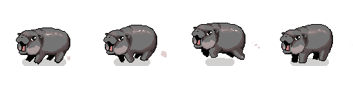

# Dev's log
    
## Oct 7

I searched for Moo Deng pixel art.

Why? Pretty much because after finished watching ManlyBadassHero play the demo of SECURITY: The horrible nights, 
I wondered if anybody had made a sprite sheet for an internet sensation baby hippo yet.

I then stumbled upon this cute sprite by [LimpCK](https://limpck.itch.io/moodeng)




To my surprise, even though it was just 4 images, I managed to make sets of animations out of it.

I really like the dash and flinch actions.

With the power of Vite and Nuxt, I deployed to this site within the same day.

What a nice DX ~ I'm just wowed.


## Oct 9

- Convert to a component, so I can use `<Moodeng />`
- Add Thai language because it is more descriptive. If you get what I mean.


## Oct 12

- Add keyboard control, W A S D / Up Down Left Right ~ Sorry, mobile users

After this point, there are many things I can do with it. 

I'm thinking about making Moo Deng dance next. 

It is suppose to bounce isn't it?

## Oct 15

I really want to refactor the control part, but already move on to code a mini dance game.  

The proper structure would be something like

```
<[Non]Playable>
    <Collision>
        <Character>
            <Moodeng/>
        <Character/>
    <Collision/>
<[Non]Playable/>

```

But now I'm stuck. 

I played several rhythm games, but I don't know how to beatmapping at all.

More like I just learned the word "beatmaps" today.

My knowledge on music theory is practically zero. I have no idea how to do timing or count BPM.

Orz

so for now I just random notes every 1 second.

## Oct 18

- Render this page with markdown
- Fix navbar UX, it's too small for tapping and remain open

Please bare with me for minimum effort on styles.

I don't usually write CSS and havn't decided on which framework to use yet. 